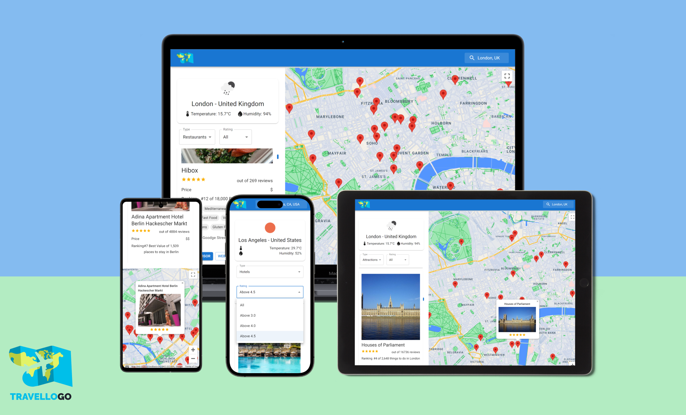

<div align="center">
  
</div>

# TravelloGo

Welcome to TravelloGo! TravelloGo is a simple web application to help travelers around the world check the best restaurants, hotels, and different attractions wherever the place they are traveling to.

## Demo

TravelloGo is deployed to Vercel. You can try it on the following URL: [travellogo.vercel.app](https://travellogo.vercel.app/).

<div align="center">
  
</div>

## Technologies Used

- React.js
- Material UI
- RapidAPI
- Google Maps API

## Installation

To install and run TravelloGo locally, follow these steps:

1. Clone the project repository.
2. Navigate to the project directory.
3. Install the necessary dependencies by running the following command:

```
npm install
```

4. Replace the environment variables with your own API keys.

5. Run the project by executing the following command:

```
npm run dev
```

6. Access the application by visintg http://127.0.0.1:5173
